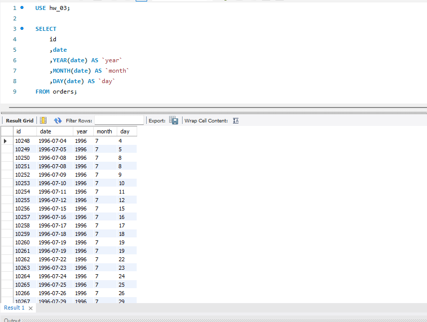

## Напишіть SQL-запит, який для таблиці `orders` з атрибута date витягує рік, місяць і число. Виведіть на екран їх у три окремі атрибути поряд з атрибутом `id` та оригінальним атрибутом `date` (всього вийде 5 атрибутів). (Рисунок-1)  

```sql
USE hw_03;

SELECT
	id
	,date
	,YEAR(date) AS `year`
	,MONTH(date) AS `month`
	,DAY(date) AS `day`
FROM orders;
```

*Рисунок-1*  
  
