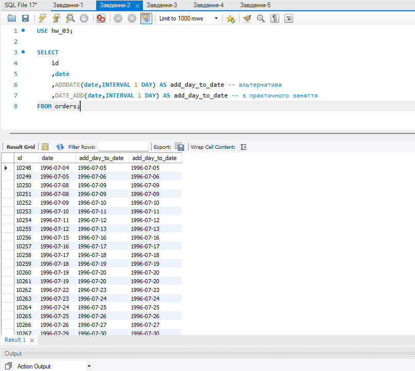

## Напишіть SQL-запит, який для таблиці orders до атрибута `date` додає один день. На екран виведіть атрибут `id`, оригінальний атрибут `date` та результат додавання. (Рисунок-2)  

```sql
USE hw_03;

SELECT
	id
	,date
    ,ADDDATE(date,INTERVAL 1 DAY) AS add_day_to_date -- альтернатива
    ,DATE_ADD(date,INTERVAL 1 DAY) AS add_day_to_date -- з практичного заняття
FROM orders;
```

*Рисунок-2*  
  
