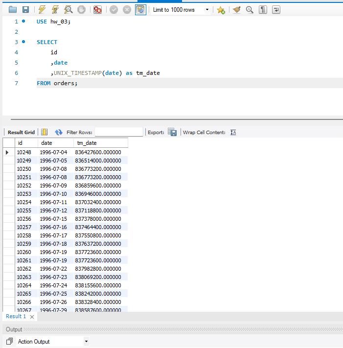

## Напишіть SQL-запит, який для таблиці `orders` для атрибута `date` відображає кількість секунд з початку відліку (показує його значення `timestamp`). Для цього потрібно знайти та застосувати необхідну функцію. На екран виведіть атрибут `id`, оригінальний атрибут `date` та результат роботи функції. (Рисунок-3)  

```sql
USE hw_03;

SELECT
	id
	,date
    ,UNIX_TIMESTAMP(date) as tm_date
FROM orders;
```

*Рисунок-3*  
  
